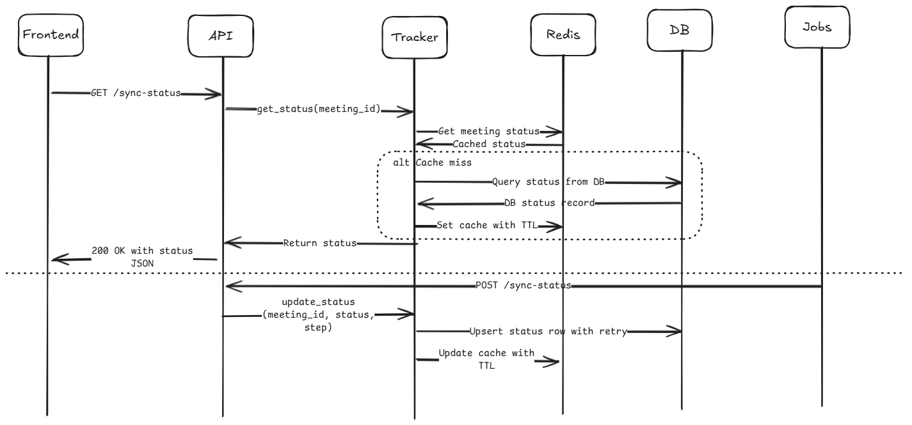

## Fathom Sync Status Indicators Backend Design

### 1. High-Level Architecture


### 2. API Endpoints

#### a. GET /sync-status?meeting_id=123
**Purpose:**
- Retrieve the latest sync status for a meeting.

**Response:**
```json
{
  "meeting_id": "123",
  "status": "in_progress",  // ["not_started", "in_progress", "success", "failure"]
  "updated_at": "2025-04-13T10:30:00Z"
}
```
**HTTP Status Codes:**
- 200 OK – valid response
- 400 Bad Request – missing/invalid meeting_id
- 403 Forbidden – unauthorized access
- 404 Not Found – no record for meeting_id

#### b. POST /sync-status
**Purpose:**
- Update the sync status, called by JobA/B/C

**Request Body:**
```json
{
  "meeting_id": "123",
  "status": "in_progress", // or "success", "failure"
  "step": "JobB" // optional for debug
}
```
**HTTP Status Codes:**
- 200 OK – update accepted
- 400 Bad Request – invalid payload
- 403 Forbidden – only internal services can update
- 500 Internal Server Error – DB issue, etc.

### 3. Status Tracking Component

#### Schema:
- Storage: Redis (with TTL and persistence) + PostgreSQL for durability
- Table: sync_status

| meeting_id | status       | updated_at          | last_step | attempts | error_message |
|------------|--------------|---------------------|-----------|----------|----------------|
| 123        | in_progress  | 2025-04-13T10:30:00Z| JobB      |    1     | null           |

#### Pseudocode for Status Tracker (Improved)
```python
class SyncStatusTracker:
    def __init__(self, redis_client, db_client):
        self.cache = redis_client  # Fast access
        self.db = db_client        # Durable store

    def get_status(self, meeting_id: str) -> dict:
        try:
            record = self.cache.get(meeting_id)
            if record:
                return record
        except Exception as e:
            log.warn(f"Redis read error: {e}")

        # Fallback to DB if Redis fails or misses
        record = self.db.query(meeting_id)
        if record:
            # Cache for future reads
            try:
                self.cache.set(meeting_id, record, ttl=3600)
            except Exception as e:
                log.warn(f"Redis write error: {e}")
            return record
        return {"status": "not_started"}

    def update_status(self, meeting_id: str, status: str, step: str, error_message: str = None):
        now = current_timestamp()
        retries = 3
        while retries > 0:
            try:
                self.db.upsert({
                    "meeting_id": meeting_id,
                    "status": status,
                    "last_step": step,
                    "updated_at": now,
                    "error_message": error_message,
                    "attempts": self._increment_attempts(meeting_id)
                })
                break
            except Exception as e:
                log.error(f"DB write failed for {meeting_id}: {e}")
                retries -= 1
                sleep_with_jitter()

        try:
            self.cache.set(meeting_id, {
                "status": status,
                "last_step": step,
                "updated_at": now,
                "error_message": error_message
            }, ttl=3600)
        except Exception as e:
            log.warn(f"Redis cache update failed: {e}")

    def _increment_attempts(self, meeting_id: str) -> int:
        existing = self.db.query(meeting_id)
        return (existing.attempts if existing else 0) + 1
```

#### Key Features:
- Dual-layer: Redis (for speed) + DB (for persistence)
- Handles Redis/cache failures gracefully
- Retries with exponential backoff for DB errors
- Tracks attempts and logs error messages for analysis

### 4. Assumptions

**Assumed during task:**
- Meeting IDs are globally unique
- Jobs are idempotent
- Frontend polls status periodically

**Would ask PM:**
- Do we show detailed step progress?
- Do we track multiple attempts?

**Exercise-only assumptions:**
- Skipping full auth logic
- UI not implemented

### 5. Auth & Validation
- JWT or session-based auth for users
- Internal token/service account for job updates
- Input validation on meeting ID and status

### 6. Frontend Responsibilities
- Poll `GET /sync-status` on page load and every X seconds
- Show:
  - `in_progress` → spinner
  - `success` → green check
  - `failure` → retry icon
  - `not_started` → no indicator

### 7. Failure Modes & Robustness

| Scenario                | Handling                                | Consequences                             |
|------------------------|------------------------------------------|------------------------------------------|
| Job fails midway       | Stuck in in_progress, retry allowed      | UI shows spinner, logs help diagnosis    |
| Final job fails        | Update as failure                        | Retry button shown, alerts for triage    |
| Redis TTL expires      | Fall back to DB, repopulate Redis        | Slight delay on UI                       |
| DB down temporarily    | Retries with backoff, alerts raised      | Eventual consistency ensured             |
| Job retry causes race  | Last-writer-wins, use job ID to dedupe   | Slight inconsistency, generally tolerable|
| Unhandled exceptions   | Logged, surfaced via observability tools | Improves debugging, resilience           |

#### Robustness at Scale
- Redis TTL-based caching (1h) + eviction policies
- Write-through pattern to ensure durability
- Scalable DB design with indexed `meeting_id`
- Monitoring: Prometheus metrics for error rate, lag
- Alerting on job or sync anomalies
- De-duplication via job ID or timestamp hashing

### 8. Optional Enhancements
- Add `sync_attempt_count`, `last_synced_by`, `job_id`
- Webhook to notify frontend on status change
- Admin view to inspect stuck/failed syncs
- UI-level retries with exponential backoff
- Metrics dashboards for sync health and SLAs

---

